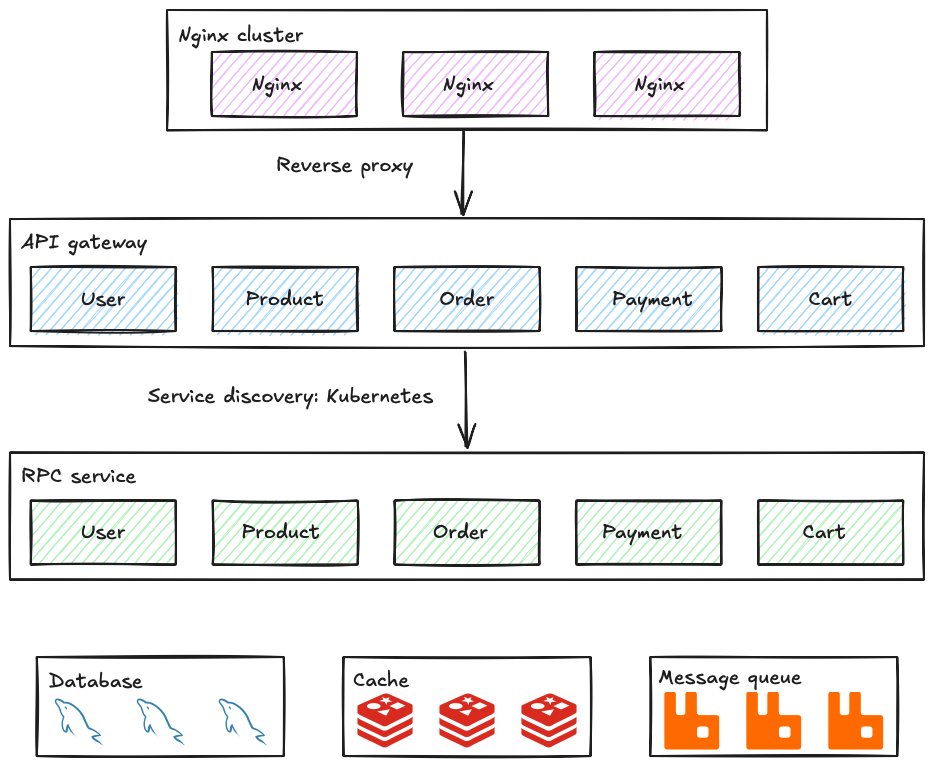
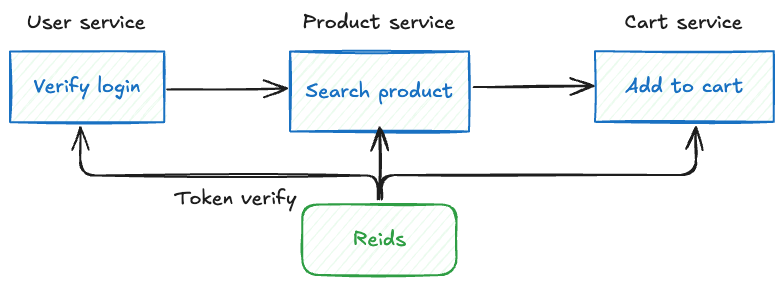
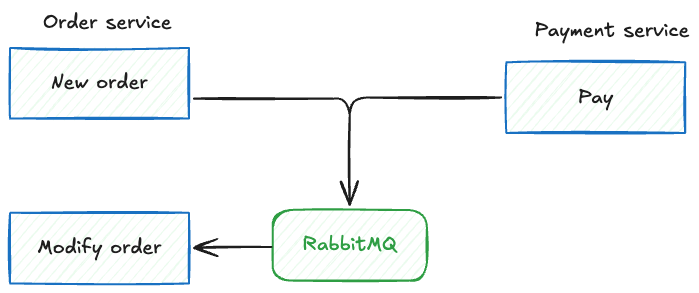
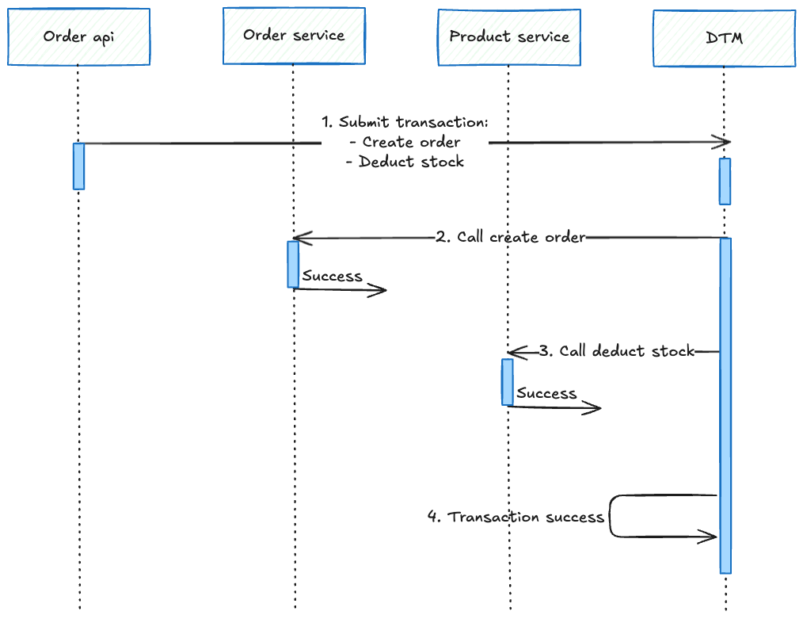

# GoMall 微服务商城系统

基于 Go-Zero 框架构建的企业级微服务电商系统，采用分布式架构设计。

## 🏗️ 系统架构

系统拆分为用户、商品、订单、购物车、支付五个微服务。



### 商城核心流程图：

用户服务



订单与支付服务



分布式事务


## 🚀 技术栈

- **框架**: Go-Zero + gRPC
- **数据库**: MySQL 
- **缓存**: Redis
- **消息队列**: 支持异步处理
- **分布式事务**: DTM
- **容器化**: Docker + Kubernetes
- **认证**: JWT

## 📦 微服务列表

| 服务 | 端口 | 功能 |
|------|------|------|
| **用户服务** | user-api/rpc | 注册登录、用户管理、JWT认证 |
| **商品服务** | product-api/rpc | 商品管理、库存控制、状态维护 |
| **订单服务** | order-api/rpc | 订单处理、异步下单、状态跟踪 |
| **购物车服务** | cart-api/rpc | 购物车管理、商品临时存储 |
| **支付服务** | payment-api/rpc | 支付处理、支付状态管理 |

## 🛠️ 快速开始

### 环境要求
- Go 1.24+
- Docker & Docker Compose
- MySQL 8.0+
- Redis

### 本地开发
```bash
# 克隆项目
git clone https://github.com/mirage208/gomall.git
cd gomall

# 构建所有服务
./build/build.sh
```

### 代码生成
```bash
# 生成 API 代码
./scripts/api_gen.sh

# 生成 RPC 代码  
./scripts/rpc_gen.sh

# 生成 Model 代码
./scripts/model_gen.sh
```

## 📁 项目结构

```
├── app/          # 微服务应用
│   ├── user/     # 用户服务
│   ├── product/  # 商品服务
│   ├── order/    # 订单服务
│   ├── cart/     # 购物车服务
│   └── payment/  # 支付服务
├── build/        # 构建配置
│   ├── docker/   # Dockerfile
│   └── ci/       # CI/CD配置
├── common/       # 公共组件
├── pkg/          # 工具包
├── scripts/      # 脚本工具
├── docs/         # 文档
└── deploy/       # 部署配置
```

## 📚 特性

- ✅ **微服务架构**: 服务独立部署，松耦合设计
- ✅ **异步处理**: 订单异步处理，提升响应速度  
- ✅ **分布式事务**: DTM保证数据一致性
- ✅ **安全认证**: JWT令牌 + 密码加密
- ✅ **容器化部署**: Docker + K8s生产就绪
- ✅ **代码生成**: 自动化API/RPC/Model生成

## 🚀 部署
### Kubernetes部署
```bash
# 生成K8s配置
./scripts/kube_gen.sh

# 部署到K8s
kubectl apply -f deploy/
```

## 📖 文档

- [用户服务设计](docs/01.用户服务.md)
- [商品服务设计](docs/02.商品服务.md) 
- [订单服务设计](docs/03.订单服务.md)
- [支付服务设计](docs/04.支付服务.md)
- [购物车服务设计](docs/05.购物车服务.md)
- [异步订单系统设计](docs/异步订单系统设计.md)
- [K8s部署指南](docs/xx.k8s部署.md)

## 🤝 贡献

欢迎提交 Issue 和 Pull Request！

## 📄 许可证

MIT License