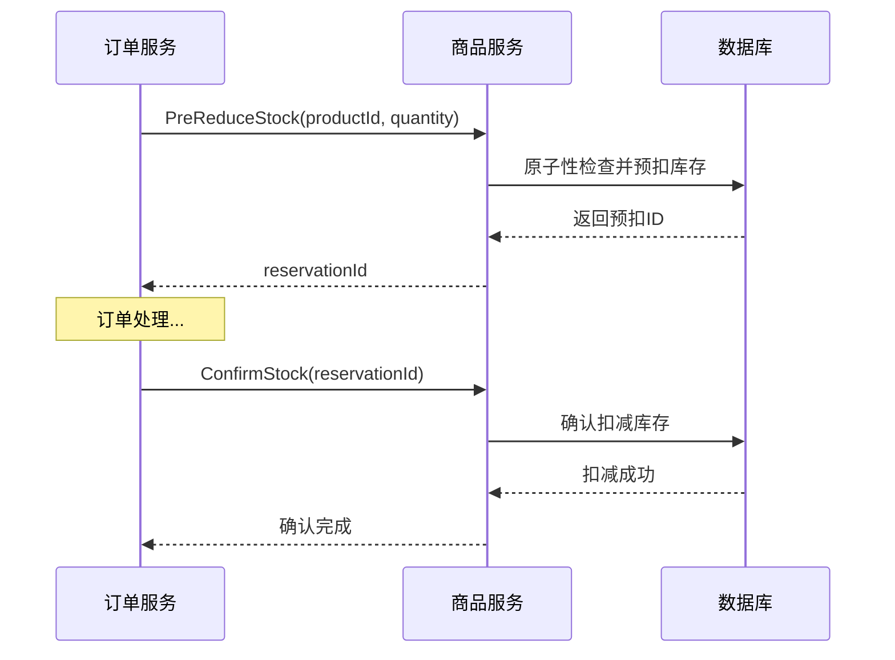

# 商品服务 (Product Service)

## 1. 服务概述

商品服务是 GoMall 电商系统的核心服务之一，负责商品的创建、修改、删除、查询以及库存管理等功能。该服务提供商品信息管理和库存控制的完整解决方案。

## 2. 数据模型

### 2.1 商品表 (product)

| 字段名      | 类型             | 长度 | 非空 | 默认值            | 说明                                  |
| ----------- | ---------------- | ---- | ---- | ----------------- | ------------------------------------- |
| id          | bigint unsigned  | -    | YES  | AUTO_INCREMENT    | 商品ID，主键                          |
| name        | varchar          | 255  | YES  | ''                | 商品名称                              |
| desc        | varchar          | 255  | YES  | ''                | 商品描述                              |
| stock       | int unsigned     | 10   | YES  | 0                 | 商品库存数量                          |
| amount      | int unsigned     | 10   | YES  | 0                 | 商品价格（单位：分）                  |
| status      | tinyint unsigned | 3    | YES  | 0                 | 商品状态 (0:下架, 1:上架, 2:库存告警) |
| create_time | timestamp        | -    | NO   | CURRENT_TIMESTAMP | 创建时间                              |
| update_time | timestamp        | -    | NO   | CURRENT_TIMESTAMP | 更新时间                              |

### 2.2 索引设计

- **主键**: `PRIMARY KEY (id)`
- **状态索引**: `KEY idx_status (status)` - 用于按状态查询商品
- **库存索引**: `KEY idx_stock (stock)` - 用于库存预警查询

## 3. 功能接口说明

### 3.1 创建商品

**功能描述**: 创建新的商品信息

- **请求方式**: `POST`
- **请求路径**: `/api/product/create`
- **权限要求**: 需要登录令牌

**业务参数**:
```json
{
  "name": "iPhone 15 Pro",        // 商品名称，必填
  "desc": "最新款苹果手机",        // 商品描述，必填
  "stock": 100,                   // 初始库存，必填
  "amount": 999900,               // 价格（分），必填
  "status": 1                     // 商品状态，必填
}
```

**返回信息**:
```json
{
  "id": 1001                      // 商品ID
}
```

### 3.2 更新商品

**功能描述**: 更新商品信息（支持部分字段更新）

- **请求方式**: `POST`
- **请求路径**: `/api/product/update`
- **权限要求**: 需要登录令牌

**业务参数**:
```json
{
  "id": 1001,                     // 商品ID，必填
  "name": "iPhone 15 Pro Max",    // 商品名称，可选
  "desc": "升级版苹果手机",        // 商品描述，可选
  "stock": 150,                   // 库存数量，必填
  "amount": 1099900,              // 价格（分），可选
  "status": 1                     // 商品状态，可选
}
```

**返回信息**:
```json
{}                                // 空响应体，成功时返回200状态码
```

### 3.3 删除商品

**功能描述**: 删除指定商品（软删除，实际为状态变更）

- **请求方式**: `POST`
- **请求路径**: `/api/product/remove`
- **权限要求**: 需要登录令牌

**业务参数**:
```json
{
  "id": 1001                      // 商品ID，必填
}
```

**返回信息**:
```json
{}                                // 空响应体，成功时返回200状态码
```

### 3.4 获取商品详情

**功能描述**: 获取指定商品的详细信息

- **请求方式**: `POST`
- **请求路径**: `/api/product/detail`
- **权限要求**: 需要登录令牌

**业务参数**:
```json
{
  "id": 1001                      // 商品ID，必填
}
```

**返回信息**:
```json
{
  "id": 1001,                     // 商品ID
  "name": "iPhone 15 Pro",        // 商品名称
  "desc": "最新款苹果手机",        // 商品描述
  "stock": 100,                   // 当前库存
  "amount": 999900,               // 价格（分）
  "status": 1                     // 商品状态
}
```

### 3.5 预扣库存 (gRPC 内部接口)

**功能描述**: 为订单创建预先扣减库存，用于防止超卖

- **调用方式**: gRPC 内部调用
- **权限要求**: 服务间调用

**业务参数**:
```json
{
  "productId": 1001,              // 商品ID，必填
  "quantity": 2                   // 预扣数量，必填
}
```

**返回信息**:
```json
{
  "reservationId": "res_12345"    // 预扣预留ID，用于后续确认或释放
}
```

### 3.6 确认库存扣减 (gRPC 内部接口)

**功能描述**: 确认预扣库存，正式扣减商品库存

- **调用方式**: gRPC 内部调用
- **权限要求**: 服务间调用

**业务参数**:
```json
{
  "reservationId": "res_12345"    // 预扣预留ID，必填
}
```

**返回信息**:
```json
{}                                // 空响应体，成功时无异常
```

## 4. 业务规则说明

### 4.1 商品创建规则

1. 商品名称不能为空，长度限制在255个字符内
2. 商品描述不能为空，长度限制在255个字符内
3. 初始库存必须大于等于0
4. 商品价格必须大于0，以分为单位存储
5. 商品状态默认为0（下架），需要手动设置为1（上架）
6. 创建成功后返回商品ID

### 4.2 商品更新规则

1. 必须提供有效的商品ID
2. 支持部分字段更新，未提供的字段保持原值
3. 库存字段为必填项，防止意外清零
4. 价格更新时必须大于0
5. 状态变更会影响商品在前台的展示

### 4.3 商品删除规则

1. 删除操作实际为软删除，将状态设置为已删除
2. 有关联订单的商品不允许物理删除
3. 删除后的商品在前台不再展示
4. 保留商品信息用于历史订单查询

### 4.4 库存管理规则

1. **预扣机制**：下单时先预扣库存，防止超卖
2. **预扣超时**：预扣库存有时效性，超时自动释放
3. **库存告警**：库存低于阈值时自动告警
4. **并发控制**：使用数据库锁机制防止并发问题
5. **库存同步**：定期同步库存数据保证一致性

### 4.5 商品状态说明

- **0 (下架)**: 商品已下架，前台不展示，不可购买
- **1 (上架)**: 商品正常销售中，前台展示，可以购买  
- **2 (库存告警)**: 库存不足但仍可销售，需要及时补货

## 5. 错误处理说明

| 错误码 | 错误信息              | 业务场景                       |
| ------ | --------------------- | ------------------------------ |
| 200    | Success               | 操作成功                       |
| 400    | Bad Request           | 请求参数格式错误或缺少必填字段 |
| 401    | Unauthorized          | 登录令牌无效或已过期           |
| 404    | Product Not Found     | 商品不存在或已被删除           |
| 409    | Insufficient Stock    | 库存不足，无法完成预扣操作     |
| 500    | Internal Server Error | 系统内部错误                   |

## 6. 数据字段说明

### 6.1 商品状态字段取值

- **0**: 下架 - 商品已下架，不对外展示
- **1**: 上架 - 商品正常销售中
- **2**: 库存告警 - 库存不足但仍可销售

### 6.2 价格字段说明

- **amount**: 以分为单位存储，避免浮点数精度问题
- **示例**: 99.99元 → 存储为 9999分

### 6.3 库存字段说明

- **stock**: 当前可用库存数量
- **最小值**: 0（库存为0时自动下架或告警）
- **库存扣减**: 通过预扣机制保证并发安全

### 6.4 时间字段

- **create_time**: 商品创建时间，自动生成
- **update_time**: 商品最后更新时间，自动更新

## 7. 高级功能

### 7.1 库存预警机制

```json
{
  "lowStockThreshold": 10,        // 低库存阈值
  "alertChannels": ["email", "sms", "webhook"],  // 告警渠道
  "autoRestock": false            // 是否自动补货
}
```

### 7.2 库存预扣流程



### 7.3 性能优化

1. **缓存策略**: 热门商品信息缓存到Redis
2. **读写分离**: 商品查询使用读库，库存操作使用写库
3. **分库分表**: 按商品类别或ID范围分片
4. **异步处理**: 库存变更日志异步记录

---

**文档版本**: v1.0  
**最后更新**: 2025年7月30日